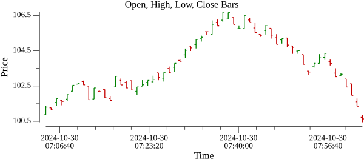
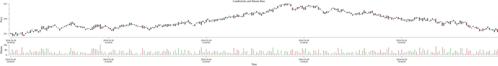

## Это курсовая работа работа по предмету "Алгоритмы Компьютерной Графики"  
## Студент группы ИУ9-52Б Черников Артём

_Работа является надстройкой к библиотеке [github.com/gonum/plot](https://github.com/gonum/plot)_

## Пользовательские построители графиков
--  
Пакет `custplotter` содержит несколько **пользовательских плоттеров, которые можно использовать для создания финансовых графиков на языке Go с использованием пакета `gonum/plot`.

### Плоттер OHLC баров

Пример кода в `candlestick-Go-Library/examples/ohlcbars/main.go` показывает, как можно создать график, содержащий OHLC бар-чарт:

### Плоттер свечей (Candlesticks)

Пример кода в `candlestick-Go-Library/examples/candlesticks/main.go` демонстрирует, как создать график со свечным чартом:

### Плоттер баров объёма торговли

Пример кода в `candlestick-Go-Library/examples/vbars/main.go` показывает, как можно создать график, содержащий бар-чарт объёма торгов:

### Накладывание графиков друг на друга по горизонтали и выравнивание 

С помощью функции `Align` можно выравнивать, например, OHLC бар-чарт и бар-чарт объёма, предоставляя, например, 2/3 доступной высоты для OHLC-чарта и 1/3 высоты для объёмного графика.

